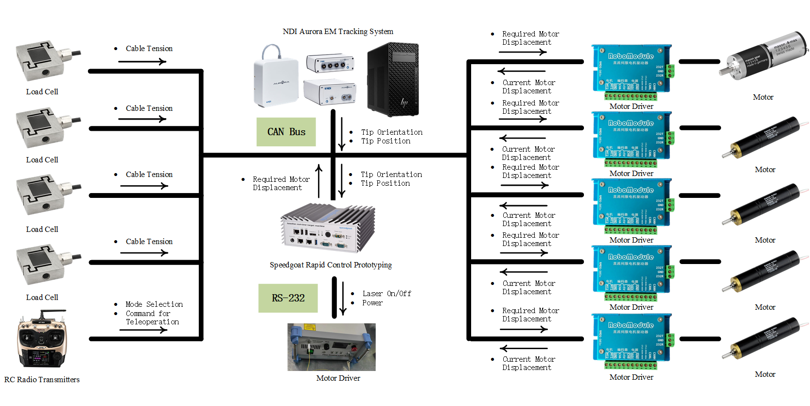
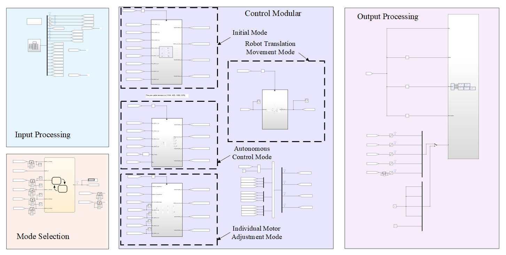

# SSMK-MPC: Data-Driven Micromotion Control for Soft Robotic Laser Surgery  

This repository provides the implementation of an **MPC controller with a data-driven surrogate model** for dynamic micromotion control in laser surgery.  

---

## ✨ Key Features

- **Surrogate Modeling**  
  Derived by adapting **Extended Dynamic Mode Decomposition (EDMD)** to approximate the Koopman operator on **low-dimensional Spectral Submanifold (SSM) coordinates**.  

- **Efficiency & Accuracy**  
  Captures task-relevant dynamics with high fidelity while preserving linearity for efficient **MPC implementation at 100 Hz**.  

- **Experimental Validation**  
  Demonstrated on **millimeter-scale figure-8 trajectory tracking**, where **SSMK-MPC** outperforms both SSMP and Koopman models, effectively suppressing oscillations seen in direct Koopman-based approaches.  

- **Surgical Relevance**  
  Precise micromotion control enables sharp incisions, reduced collateral thermal damage, and motion compensation for respiration and heartbeat.  

---
## 🚩 Introduction

### 1. System communication architecture

**Figure 1:** System communication architecture

The system communication architecture of the soft laser manipulator is illustrated in Figure 1. The control program is implemented and deployed on the rapid control prototyping machine, Speedgoat, to execute the control algorithm. All input signals required by the algorithm (e.g., cable tension, channels from the RC transmitter) and all output signals calculated by the algorithm (e.g., desired motor displacements) are transmitted to Speedgoat for processing. At the physical communication layer, most components of the soft laser manipulator system—such as Speedgoat, motor drivers, EM tracker, load cells, and the RC transmitter—communicate via CAN bus. The laser system communicates with Speedgoat via RS-232, allowing the laser to be turned on or off using the RC transmitter.

### 2. Control algorithm architecture

**Figure 2:** Control algorithm architecture

The control algorithm architecture of the soft laser manipulator is illustrated in Figure 2. The block on the left represents **Input Processing**, which handles incoming signals from the CAN bus. Below it is the **Mode Selection** block, responsible for initializing the motor driver and activating the appropriate mode based on the RC transmitter signal. At the center of the Simulink model lies the **Control Module**, which consists of four subsystems: **Initial Mode**, **Autonomous Control Mode**, **Individual Motor Adjustment Mode**, and **Robot Translation Movement Mode**.

The **Initial Mode** equalizes cable tension across the four cables at the beginning of each trial using load cell feedback, as pretension is critical for accurate laser spot steering. The **Task-Specific Control Mode** serves as the main block that executes the control algorithms designed for different tasks. For example, in the teleoperation task for confined-space navigation, this mode is customized to tune the bending direction via the RC transmitter. In the data collection task with random inputs, it is configured to replay offline-generated random control sequences. In autonomous control tasks, it is replaced by the constructed SSMK/SSMP/K-MPC controllers. The **Individual Motor Adjustment Mode** allows users to control each motor independently through the RC transmitter. The **Robot Translation Movement Mode** enables translation control of the entire robot system via the RC transmitter.

Finally, the **Output Processing** module encodes the motor displacement commands into CAN bus signals.

Please refer to the models in ~/matlab folder for more information.

---

## 🚀 Quick Start (Example:SSMK-MPC)

### 1. Clone the repository
```bash
git clone https://github.com/YANYongjun1993/SoRoLaser_SSMK.git
cd ssmk-mpc
```
### 2. Collect decaying and control data
- Use the Simulink model ControlDataSSM0709.slx from ~/matlab/TeleOperationDataCollection to collect the soft manipulator’s state data under your defined control inputs.

### 3. Training the SSMK model
- Save data in `~/matlab/SSMK-Learning/rawData`.
- Run dataPreprocessing.m to preprocess the data.
- Run `SSMKTraining.m` to train the SSMK model.
- Outputs
  - `~/matlab/SSMK-Learning/SSM_model.mat`
  - `~/matlab/SSMK-Learning/systems/fromData/n-2_m-2_del-1_2025-08-21_11-40.mat`

### 4. Deploy the SSMK model as an SSMK-MPC controller
- Go to `~/matlab/SSMK-MPC`.
- Run `SSMK_SymFunc_Precompute.m` to generate symbolic expressions.
- Run `SSMK_Matrics_Precompute.m` to compute offline matrices (see [Dense MPC Formulation](https://www.sciencedirect.com/science/article/pii/S000510981830133X?casa_token=hwZ4-uQ4BbcAAAAA:DMWDQx4VhUhP9IqOeqC3Vdn4yEIv91Iu6oIYq6NF3NjCUqx7c5nGeiKGV1PrisWBF9uID5PV)).
- Update file paths for `SSM_model.mat` and `n-2_m-2_del-1_2025-08-21_11-40.mat` in both scripts.
- Run `SSMKMPC.slx`.

### 5. Note
- Currently runs only on PC with MATLAB and quadprog.
- Migration to Speedgoat (real-time) is in progress using `OSQP` to replace `quadprog`.
